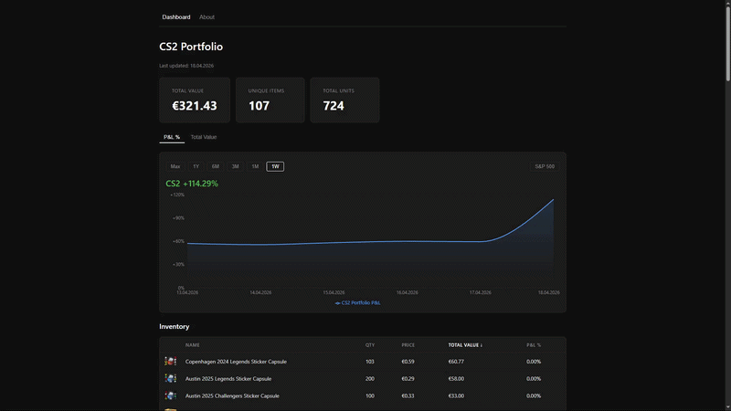

# CS Investment Tracker

[](https://github.com/Ville-prog/CSinvestmentTracker/actions/workflows/ci.yml)
[](https://csinvestmenttracker.vercel.app/)
[](https://github.com/Ville-prog/CSinvestmentTracker/blob/main/LICENSE)

A personal CS2 skin investment tracker that records the daily market value of a Steam inventory, charts its returns over time, and compares them against the S&P 500. Essentially a stock portfolio tracker, but for CS2 skins.

## Live App


[](https://csinvestmenttracker.vercel.app/)

*Live view of my personal portfolio. Tracking started **19.4.2026** so the live app has limited history, the GIF uses illustrative data to demonstrate the full feature set.*

## What is the CS2 skin market?

CS2 (Counter-Strike 2) is a free-to-play competitive shooter made by Valve with an **in-game economy** where players own cosmetic weapon skins. These skins are stored on your Steam account and can be freely traded, bought, and sold. Unlike most in-game items, **CS2 skins have real monetary value.**

Over time, the CS2 skin market has grown into a multi-billion dollar ecosystem with characteristics comparable to traditional financial markets. Like equities, individual items can vary significantly in price, but at the portfolio level the market exhibits more stable, index-like behavior.

This tracker is built around that perspective: treating a **CS2 inventory as a portfolio** and measuring its **performance against a traditional benchmark like the S&P 500**.

## Steam API limitations

This app currently only works for a single, hardcoded Steam inventory (mine). This is a deliberate design choice due to Steam API restrictions:

- The Steam community inventory endpoint is public but heavily rate limited
- There is no official API for real-time CS2 market prices
- Truncated or silently filtered responses. Even within rate limits, Steam will occasionally return a partial snapshot of an inventory with no error signal.

Many third-party tracker sites work around these by running networks of Steam bot accounts that scrape the endpoints continuously, which violates Steam's Terms of Service. This app takes the compliant approach instead: a single nightly job that respects rate limits (one request every 4 seconds) and is designed defensively around truncation and gaps.

## How it works

A nightly job runs at 11 PM UTC in two stages:

1. **Inventory sync:** Fetches the Steam inventory and upserts newly discovered items.
2. **Price collection:** Fetches current market prices for all tracked items in the database.

Prices are stored daily, building a historical time series. A portfolio snapshot (total value, cost basis, unit count) is recorded at the end of each run. Because pricing is driven by the database rather than the Steam response, transient API gaps don't distort the chart, items still get priced even on days Steam returns a partial inventory.

## P&L calculation

Portfolio profit/loss is tracked through two charts on the dashboard:

**1. Total Value:** Raw portfolio value in EUR over time. Unlike the P&L chart, this reflects absolute value including the effect of adding new items to the inventory.

**2. P&L %:** CS2 portfolio profit/loss as a percentage. The S&P 500 line can be toggled on or off for comparison. Calculated as profit/loss relative to cost basis:

```
P&L % = (current value - cost basis) / cost basis * 100
```

When the tracked quantity of an existing item increases (new units acquired), those new units are added to the cost basis at today's market price. When it decreases (units sold), the cost basis is scaled proportionally. Items seen for the very first time have their cost basis set to today's market price automatically. **This means the chart only moves when prices change; adding new items to the inventory does not affect the P&L line.** This mirrors how real investment portfolio trackers work: buying new shares increases your portfolio value, but does not count as a gain. **Only price appreciation of assets already held moves the return percentage.**

## Stack

- **Backend:** Java 21 / Spring Boot 3, deployed on Railway via Docker
- **Database:** PostgreSQL, managed through Railway
- **Frontend:** React with Recharts, deployed on Vercel
- **External APIs:** Steam Community Market (prices), Yahoo Finance (S&P 500 history)

## Structure

High-level flow: `Steam API → nightly job → PostgreSQL → Spring Boot REST → React on Vercel`.

```
CSinvestmentTracker/
├── backend/
│   └── src/main/java/com/cstracker/
│       ├── controller/         # REST endpoints (inventory, portfolio, market)
│       ├── entity/             # JPA entities (Item, Price, PortfolioSnapshot)
│       ├── model/              # Request/response records (SteamItem, InventoryItemView, ...)
│       ├── repository/         # Spring Data JPA repositories
│       ├── service/            # Business logic (price collection, Steam API, market data)
│       └── config/             # CORS and RestTemplate configuration
└── frontend/
    └── src/
        ├── pages/              # Dashboard, Inventory
        └── components/         # PortfolioChart, PortfolioValueChart, InventoryTable
```


## Limitations and future improvements

- **Historical data:** The app only shows data from when tracking began. There is no way to backfill historical portfolio value before the first nightly run, which was on **19.4.2026**.
- **Storage Containers:** Steam's inventory API only exposes the base inventory (up to 1000 slots). Items stored inside Storage Containers are not visible to the API and cannot be tracked. Items must be moved to the base inventory to be included.
- **Trade cooldowns:** Newly traded items have a 7-day market cooldown during which they appear as non-marketable and are skipped by the price collection job.
- **Single inventory:** The deployed live app currently tracks only one hardcoded Steam inventory. A future improvement could allow multiple Steam IDs to be registered, each with their own nightly price collection and portfolio history, though this would require careful rate limit management across all tracked inventories.
- **Trade-out detection delay:** Because the app continues to price items that are not in a given Steam response (to absorb API gaps), truly traded-away items are only recognised after 7 consecutive days outside the inventory response.
